# GPDK45nm Standard Cell Library

## Design, Layout, Physical Verification and Characterization

This project focuses on the design, custom layout implementation, physical
verification, and characterization of a standard cell library using
**GPDK45nm technology** in Cadence Virtuoso.

The developed library consists of multiple combinational standard cells
implemented using a **9-track standard-cell architecture** with a fixed
cell height of **1.8 µm**.

---

## Project Overview

Standard-cell libraries are fundamental building blocks used in modern
digital ASIC design. A standard cell is designed, physically verified,
and characterized so that it can be reused during higher-level digital
design and physical implementation.

In this project, multiple standard cells were developed from schematic
design through custom layout, physical verification, parasitic extraction,
and post-layout characterization.

### Standard Cells Developed

- INV X1
- AOI21 X1
- AOI211 X1
- AOI22 X1
- AOI221 X1

---

## Project Objectives

The main objectives of this project were:

- Design schematic implementations of standard cells
- Create reusable symbol views
- Implement custom layouts using a 9-track architecture
- Maintain a fixed standard-cell height of 1.8 µm
- Perform Design Rule Check (DRC)
- Perform Layout Versus Schematic (LVS)
- Generate parasitic-extracted views
- Perform pre-layout and post-layout simulations
- Characterize timing and power performance
- Analyze the effect of layout parasitics
- Establish a reusable methodology for standard-cell library development

---

# Technology and Tools

## Technology

**GPDK45nm**

## EDA Tools

- Cadence Virtuoso
- Cadence Assura
- Spectre

## Design Flow

```text
Logic Function
      ↓
Schematic Design
      ↓
Symbol Creation
      ↓
Custom Layout
      ↓
DRC Verification
      ↓
LVS Verification
      ↓
Parasitic Extraction
      ↓
Pre-Layout / Post-Layout Simulation
      ↓
Timing & Power Characterization
```

---

# Standard Cell Architecture

The standard cells were implemented using a **9-track standard-cell
architecture**.

### Cell Height

```text
1.8 µm
```

### Characterization Supply

```text
VDD = 1.1 V
```

The cell width varies depending on the complexity of the logic function,
while the cell height remains fixed according to the adopted architecture.

---

# 1. INV X1

The INV X1 cell is a CMOS inverter implemented using GPDK45nm technology.

### Cell Information

| Parameter | Value |
|---|---|
| Cell | INV X1 |
| Drive Strength | X1 |
| Technology | GPDK45nm |
| Architecture | 9-track |
| Cell Height | 1.8 µm |
| Input | A |
| Output | Y |
| Supply | VDD, VSS |

---

## INV X1 Schematic

The CMOS inverter schematic was implemented using complementary PMOS and
NMOS devices.

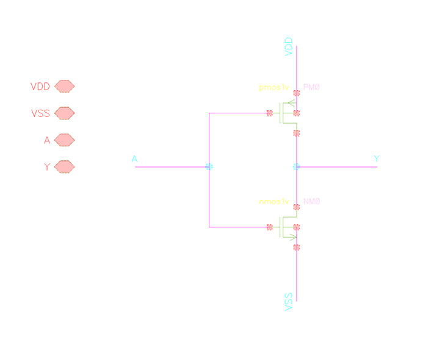

---

## INV X1 Symbol

The symbol view was created for integration with higher-level circuits
and testbenches.

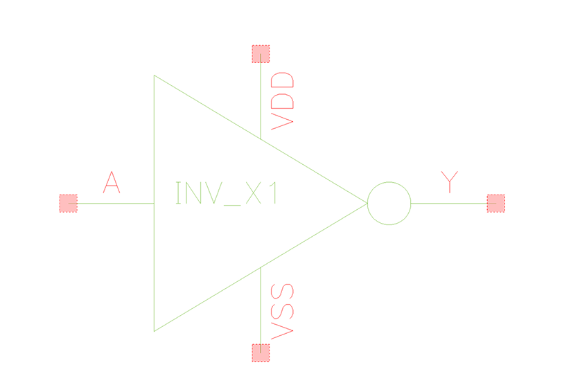

---

## INV X1 Layout

The custom layout includes the PMOS and NMOS devices, power rails,
routing connections, and accessible signal pins.

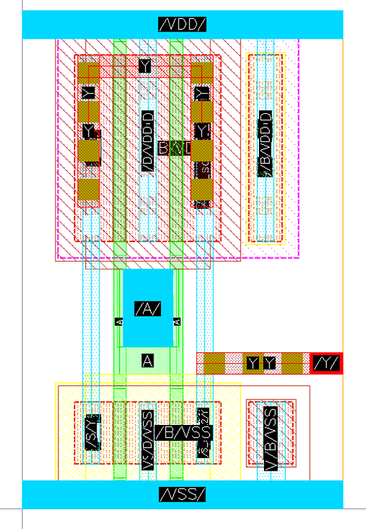

---

## INV X1 Parasitic Extracted View

The extracted view contains parasitic resistance and capacitance associated
with the physical layout.

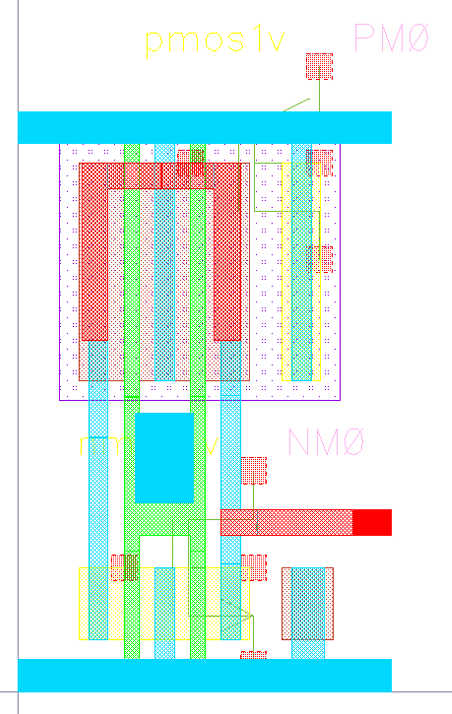

---

## INV X1 Testbench

A reusable testbench was created for pre-layout and post-layout simulation.

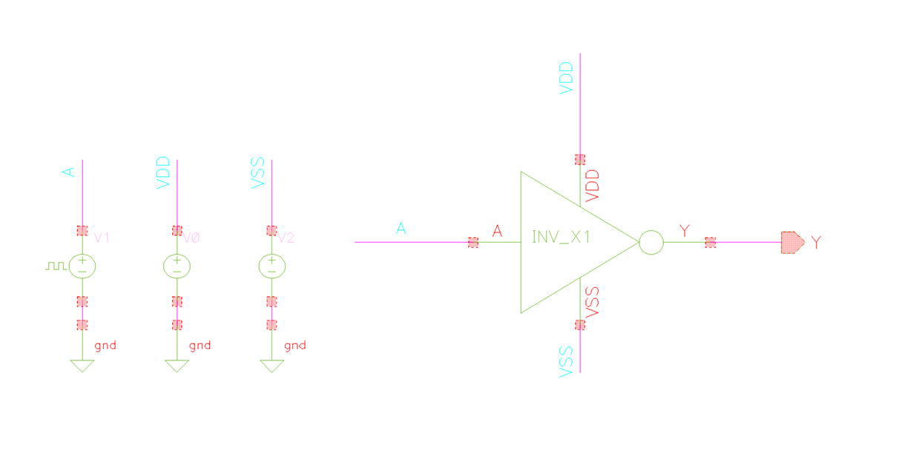

---

## INV X1 Characterization

The INV X1 cell was characterized for:

- Rise time
- Fall time
- Rise delay
- Fall delay
- Average propagation delay
- Total average power
- Static/leakage power
- Dynamic power
- Cell area

### Rise Time

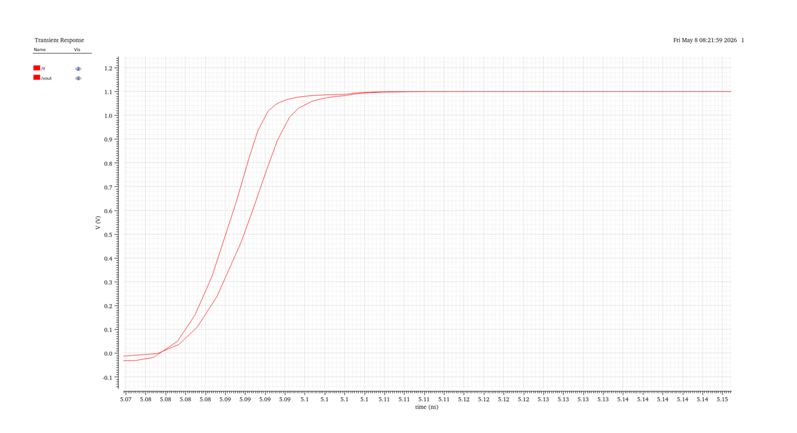

### Fall Time

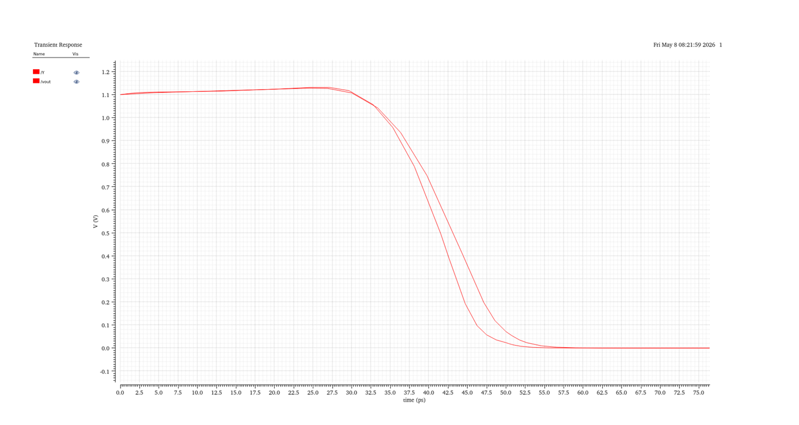

### Rise Delay

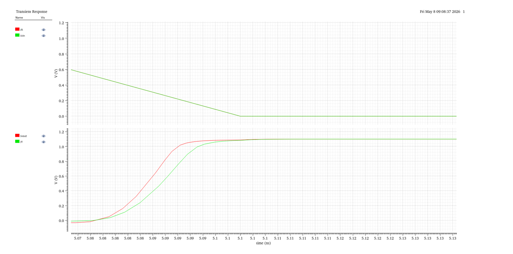

### Fall Delay

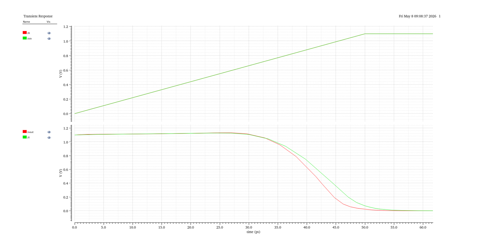

### Power Analysis

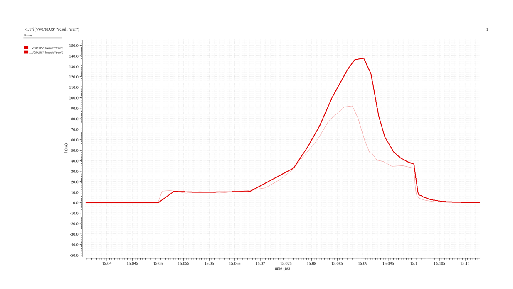

### Results

The INV X1 cell was characterized using pre-layout and post-layout
simulations. Timing and power parameters were analyzed to evaluate the
effect of layout parasitics.

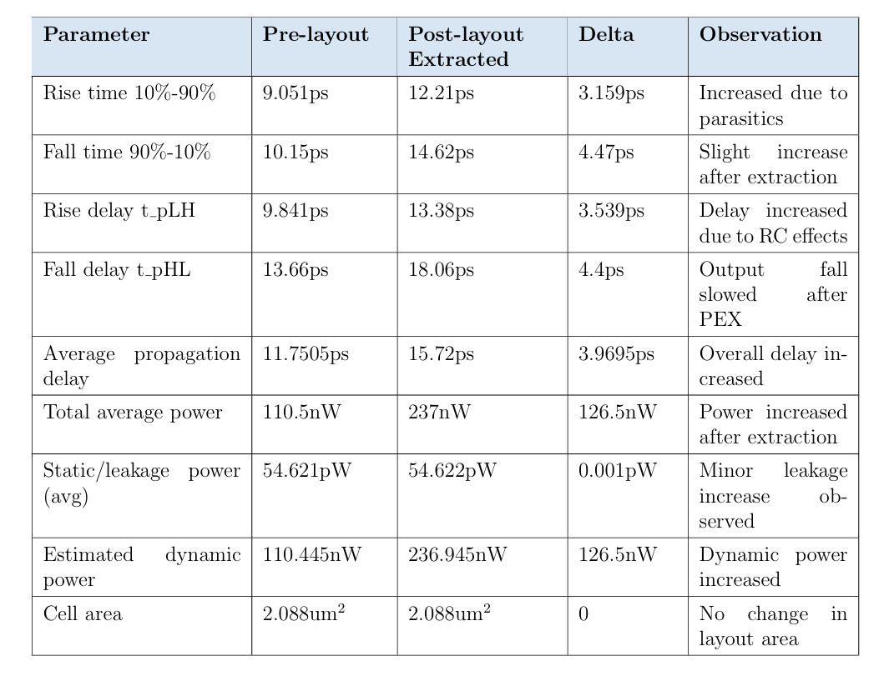

---

# 2. AOI21 X1

The AOI21 X1 standard cell was developed using the same standard-cell
design methodology.

The implementation includes:

- Schematic
- Symbol
- Custom layout
- Parasitic-extracted view
- Testbench
- Physical verification
- Characterization


### Symbol


### Layout


### Extracted View


### Testbench


### Results

The AOI21 X1 cell was characterized using pre-layout and post-layout
simulations. Timing and power parameters were analyzed to evaluate the
effect of layout parasitics.


---

# 3. AOI211 X1

The AOI211 X1 standard cell was implemented using complementary CMOS
logic and the adopted 9-track standard-cell architecture.

### Schematic


### Symbol


### Layout


### Extracted View


### Testbench


### Results

The AOI211 X1 cell was characterized using pre-layout and post-layout
simulations. Timing and power parameters were analyzed to evaluate the
effect of layout parasitics.


---

# 4. AOI22 X1

The AOI22 X1 standard cell was designed and implemented using the same
schematic-to-layout and verification methodology.

### Schematic


### Symbol


### Layout


### Extracted View


### Testbench


### Results

The AOI22 X1 cell was characterized using pre-layout and post-layout
simulations. Timing and power parameters were analyzed to evaluate the
effect of layout parasitics.


---

# 5. AOI221 X1

The AOI221 X1 standard cell was implemented following the same physical
design and verification methodology.

### Schematic


### Symbol


### Layout


### Extracted View


### Testbench


### Results

The AOI221 X1 cell was characterized using pre-layout and post-layout
simulations. Timing and power parameters were analyzed to evaluate the
effect of layout parasitics.


---

# Physical Verification

The developed layouts were verified using Cadence Assura.

## DRC

Design Rule Check was performed to ensure that the physical layout satisfies
the required design rules.

## LVS

Layout Versus Schematic verification was performed to confirm that the
physical implementation corresponds to the intended circuit schematic.

## PEX

Parasitic Extraction was performed to obtain parasitic-aware extracted views
for post-layout simulation.

---

# Characterization Methodology

The standard cells were characterized using transient simulations.

The following parameters were measured:

### Timing

- Rise Time
- Fall Time
- Rise Delay (tpLH)
- Fall Delay (tpHL)
- Average Propagation Delay

### Power

- Total Average Power
- Static / Leakage Power
- Dynamic Power

### Physical

- Cell Area

---

## Rise Time

Rise time is measured as the time required for the output to transition
from 10% to 90% of VDD.

## Fall Time

Fall time is measured as the time required for the output to transition
from 90% to 10% of VDD.

## Propagation Delay

Propagation delay is measured using the 50% VDD crossing points of the
input and output signals.

## Dynamic Power

Dynamic power is obtained from the switching power after accounting for
static/leakage power.

## Cell Area

Cell area is determined from the physical dimensions of the standard-cell
layout.

---

# Pre-Layout vs Post-Layout Analysis

Parasitic extraction introduces additional resistance and capacitance into
the circuit model.

The project therefore compares pre-layout and post-layout results to study
the impact of physical implementation on:

- Timing
- Propagation delay
- Power consumption
- Leakage power
- Dynamic power
- Cell performance

For the INV X1 cell, post-layout extraction increased timing delay and
average power while the cell area remained unchanged.

### INV X1 Characterization Results

| Parameter | Pre-Layout | Post-Layout | Delta |
|---|---:|---:|---:|
| Rise Time | 9.051 ps | 12.21 ps | 3.159 ps |
| Fall Time | 10.15 ps | 14.62 ps | 4.47 ps |
| Rise Delay | 9.841 ps | 13.38 ps | 3.539 ps |
| Fall Delay | 13.66 ps | 18.06 ps | 4.40 ps |
| Average Propagation Delay | 11.7505 ps | 15.72 ps | 3.9695 ps |
| Total Average Power | 110.5 nW | 237 nW | 126.5 nW |
| Static/Leakage Power | 54.621 pW | 54.622 pW | 0.001 pW |
| Estimated Dynamic Power | 110.445 nW | 236.945 nW | 126.5 nW |
| Cell Area | 2.088 µm² | 2.088 µm² | 0 |

---

# Key Results

The project demonstrated a complete standard-cell development methodology:

```text
Schematic
   ↓
Symbol
   ↓
Layout
   ↓
DRC
   ↓
LVS
   ↓
PEX
   ↓
Post-Layout Simulation
   ↓
Characterization
```

The developed cells were found to be functionally correct, DRC-clean and
LVS-matched according to the project report.

The characterization also demonstrated the effect of layout parasitics,
with extracted parasitic resistance and capacitance increasing timing delay
and power consumption.

---

# Key Learning Outcomes

Through this project, I gained practical experience in:

### Standard Cell Design

- CMOS logic implementation
- Standard-cell architecture
- Schematic design
- Symbol creation
- Custom layout design
- Cell sizing and physical organization

### Physical Verification

- Design Rule Check (DRC)
- Layout Versus Schematic (LVS)
- Parasitic Extraction (PEX)
- Assura-based physical verification

### Circuit Characterization

- Transient simulation
- Rise/fall time measurement
- Propagation delay measurement
- Static power analysis
- Dynamic power analysis
- Leakage power analysis
- Cell area measurement
- Pre-layout/post-layout comparison

### VLSI Design

- Full-custom CMOS layout
- Digital standard-cell development
- Layout parasitics
- Physical implementation
- ASIC-oriented design methodology

---

# Tools Used

```text
Cadence Virtuoso
Cadence Assura
Spectre
GPDK45nm
```

---

# Future Scope

The developed standard-cell library can be extended by:

- Designing additional combinational cells
- Designing multiplexers
- Designing encoders and decoders
- Designing latches and flip-flops
- Designing arithmetic building blocks
- Developing multiple drive strengths such as X2, X4 and X8
- Characterization across PVT corners
- Generating Liberty (.lib) files
- Generating LEF files
- Layout optimization for area, delay and power
- Improving routing accessibility and manufacturability
- Developing a more complete standard-cell library for ASIC design

---

# Repository Contents

```text
GPDK45nm-Standard-Cell-Library/
│
├── README.md
│
├── images/
│   ├── INV X1
│   ├── AOI21 X1
│   ├── AOI211 X1
│   ├── AOI22 X1
│   └── AOI221 X1
│
└── results/
    └── characterization.md
```

---

# Disclaimer

This repository contains selected project documentation, screenshots,
results, and learning outcomes.

No proprietary PDK files, foundry rule decks, technology files, Cadence
library databases, or other restricted EDA/project files are included.

---

# Author

**Sahil Nadaf**

Electronics and Communication Engineering  
KLE Technological University

### Areas of Interest

- Analog & Mixed-Signal IC Design
- Digital VLSI
- Standard Cell Design
- Custom Layout
- Physical Verification
- ASIC Design
- Semiconductor Technology
